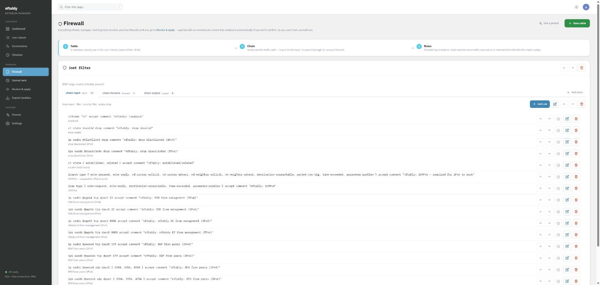
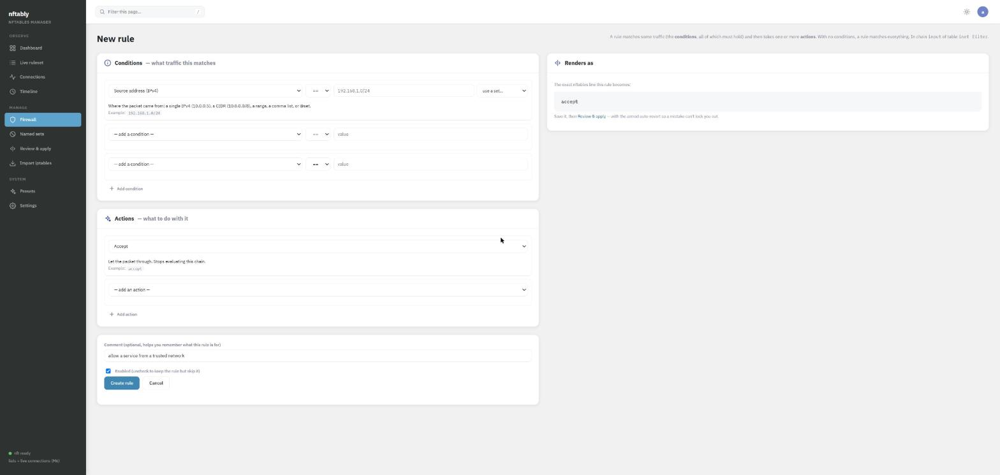
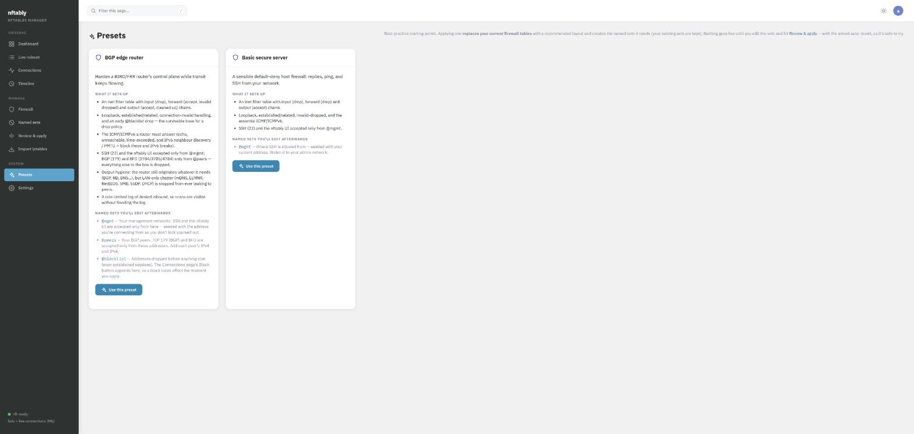
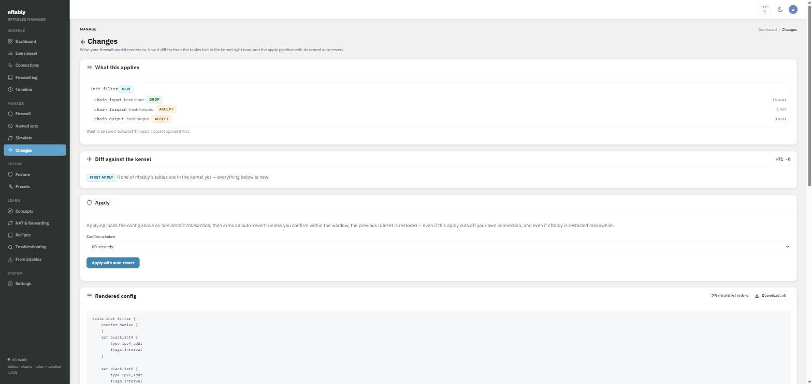
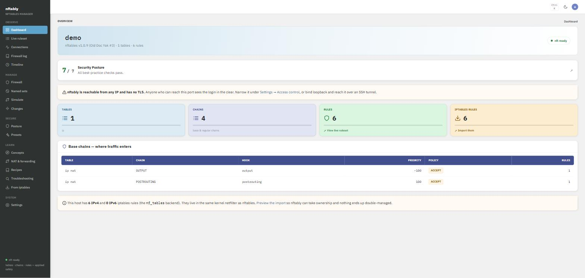

# nftably

A web UI for **nftables**. nftably manages the firewall as its real object model —
**tables → chains → rules** in any family — and makes every option a typed control
that explains what it does, so you can build anything nftables can express without
memorising its syntax. Changes are applied as one atomic transaction with an armed
auto-revert, so a bad rule can never lock you out of the box you're editing.

It's a single Go binary backed by SQLite. No agent, no cloud, no external
dependencies at runtime beyond `nft` itself. Install the package, run
`nftably init`, and go.

> **Status: beta.** nftably reads and writes netfilter through `nft`. Every apply
> is dry-run through `nft --check`, loaded as one atomic transaction and armed with
> an auto-revert — but it is young software. Run it behind the access list or an
> SSH tunnel, and review the diff before you apply.

## Screenshots

The firewall is tables → chains (shown as tabs) → rules, each rendered as the real
nft line it becomes:



| The typed, explained rule editor | Best-practice presets |
| :---: | :---: |
|  |  |
| **Review the diff, apply with auto-revert** | **A live overview** |
|  |  |

<sub>All addresses shown are documentation examples (RFC 5737 / RFC 3849).</sub>

---

## Why

Managing a firewall by hand-editing `/etc/nftables.conf` over SSH is error-prone,
and the scariest part is that the mistake which locks you out is the same command
that applies the fix. nftably makes firewall changes on a remote host **safe to
make** and **easy to get right**:

- **The real model, not a curated subset.** You manage tables, chains (base chains
  hook into the traffic path; regular chains are jump/goto targets) and rules. A
  rule is a set of match conditions and action statements — and every knob nftables
  offers is a first-class, explained control, so you're never dropped to raw syntax.
- **Explained as you build.** Pick a condition and the editor tells you, in plain
  words, what it matches and gives an example; pick an action and only its relevant
  fields appear. Interfaces come from the box's real list, and you point a rule at a
  named set instead of retyping addresses.
- **One model for v4 and v6.** netfilter's `inet` family carries both in a single
  table, so a rule written once covers both protocols.
- **Lockout safety.** Every apply is an atomic `nft -f` transaction — validated by
  `nft --check` first — with an armed auto-revert: if you don't confirm within the
  window, the previous ruleset is restored, even if your SSH session drops, and even
  if nftably itself is restarted mid-window (the revert snapshot is persisted). A
  lint pass warns before an apply that would leave no way back in.
- **Know before you apply.** A built-in **packet simulator**: describe a packet —
  protocol, source, port, interface, connection state — and get a step-by-step
  trace of exactly which rule decides it, ending in accept, drop or reject. It
  evaluates your model the way netfilter would, touching nothing, so you can answer
  *"will my SSH still get in?"* before you commit.
- **Named sets, static or living.** A named set is a group of IPs/ranges. Point
  rules at one (`ip saddr @office`) and edit the set later — every rule that
  references it follows. Fill a set by hand, or have it **built from a country**
  (GeoIP) or a **remote feed** (a threat-intel blocklist) and kept refreshed on a
  schedule — so you can `drop` an entire country or subscribe to a blocklist and
  let it maintain itself. Referenced sets render into the tables that use them.
  On the Connections view, **one click blocks an entire country** — it builds the
  GeoIP set and the early drop rules for you.
- **Presets to start from.** One-click, best-practice starting points — a hardened
  **BGP edge router**, a **basic secure server** — that scaffold the tables, chains,
  rules and editable named sets for you, each explaining what it adds and why.
- **See, then act.** The Connections page shows every flow conntrack knows about —
  to, from and through the box, with countries when you point nftably at a GeoIP
  database. The live ruleset viewer shows exactly what the kernel is running; a
  rule with a *Count* action shows its live packet/byte total right on the Firewall
  page; and a rule with a *Log* action feeds the built-in **firewall log viewer** —
  build a rule, apply it, and watch it catch traffic, in numbers and in detail.
- **One Posture page that assesses and hardens.** It grades your model against what
  a solid host firewall needs — default-deny, the survivable base, IPv6's ICMP,
  anti-spoofing, scoped SSH — explaining *why each matters*; and, on the same page,
  it scans what's actually listening on the box and runs each service through the
  simulator against your model, telling you what your firewall really does about it —
  *"PostgreSQL is reachable from the internet"* or *"sshd is listening but a
  connection from outside would be dropped"*. Both halves offer safe one-click fixes
  that land on the Review page behind the auto-revert.
- **Learn while you harden.** A **Concepts** page teaches how nftables actually works
  (the packet's journey through the hooks, chains, connection tracking, sets) in
  plain language, so someone new to firewalls can go from *"what's a chain?"* to a
  hardened box.
- **Graph it in Grafana.** An opt-in Prometheus **`/metrics`** endpoint turns every
  rule with a *Count* action into a time series (`nftably_rule_packets_total` /
  `_bytes_total`) — watch drops and accepts move — plus table/chain/rule counts and
  an `nftably_up` health gauge. Off by default; enabling it under Settings mints a
  bearer token the scraper must present.

## The BGP edge router preset

Running a BGP router (BIRD/FRR)? The preset builds a control-plane hardening baseline
that `nft` accepts as-is:

- a policy-**drop** input chain with loopback, connection-invalid and
  established/related handling, plus the ICMP/ICMPv6 a router must answer (block the
  IPv6 neighbour-discovery / PMTU messages and IPv6 stops working);
- **SSH and the nftably UI accepted only from `@mgmt`** — seeded with the address
  you're connecting from, so applying it can't lock you out;
- **BGP (TCP 179) and BFD (UDP 3784/3785/4784) accepted only from `@peers`** —
  everything else to the box is dropped;
- a rate-limited log of denied inbound, so scans are visible without flooding the log;
- a forward chain that routes transit but drops invalid.

You then fill in two sets — `@peers` (your peers, v4 and v6) and `@mgmt` (widen to your
management network) — then Review to apply.

## Quick start

### Try it in Docker (a safe sandbox)

Kick the tyres without touching your host firewall. This runs nftably in its own
network namespace, where it gets a private, fully writable nftables to manage —
detect nft, apply real rules, watch live counters — completely isolated from your
machine.

```sh
docker compose -f docker-compose.demo.yml up --build
```

Then open **http://127.0.0.1:8099** and log in with `admin` / `nftably-demo`.
Apply a preset, watch the live ruleset and per-rule counters, enable the
Prometheus `/metrics` endpoint under Settings. `down` then `up` for a clean slate.
(To manage a real host's firewall instead, use `docker-compose.yml`, which shares
the host network namespace — see the comments in that file.)

### From a package (Debian/Ubuntu)

```sh
sudo apt install ./nftably_*_amd64.deb   # pulls in nftables
sudo nftably init                        # create the admin account
sudo nftably doctor                      # check nft access + database
sudo systemctl enable --now nftably
```

Then browse to `http://<host>:8080`.

### From source

```sh
go build -o nftably ./cmd/nftably
sudo ./nftably init   --db /var/lib/nftably/nftably.db
sudo ./nftably server --db /var/lib/nftably/nftably.db
```

`nftably` reads and writes netfilter through `nft`, which needs `CAP_NET_ADMIN` — in
practice run it as root, or (as the packaged systemd unit does) as a dedicated account
granted only that one capability.

## Commands

```
nftably init      create the database and admin account
nftably doctor    preflight: nft installed & usable, iptables coexistence, db writable
nftably detect    print the detected backend and a ruleset summary
nftably server    run the web UI
nftably version   print the version
```

## Security posture

nftably binds every interface by default and serves plain HTTP unless you give it a
certificate. On a fresh install its access list is empty (allow-all), and the UI warns
you about this until you narrow it. Ways to close it down:

- **Access list** — Settings → Access control. One IP/CIDR per line. Loopback is
  always allowed, so an SSH tunnel can never lock you out.
- **Native TLS** — `--tls-cert cert.pem --tls-key key.pem` (TLS 1.2 minimum).
- **Loopback + SSH tunnel** — start with `--listen 127.0.0.1:8080` and reach it over
  `ssh -L 8080:127.0.0.1:8080 host`.

The blocked-client path closes the TCP connection outright, so a scanner can't even
tell there's a service on the port. Every response carries hardening headers (a strict
CSP with no inline scripts or styles, no framing, no cross-origin reads), cross-origin
POSTs are rejected server-side, session tokens are stored only as hashes, failed logins
are rate-limited per IP, and operator actions are
recorded on the event timeline.

Found a vulnerability? See [SECURITY.md](SECURITY.md).

## Architecture

```
cmd/nftably/       CLI: init · doctor · detect · server
internal/nft/      shell out to nft (-j JSON for structure, -a text for wording,
                   -c for dry-run validation); backend detection; iptables preview
internal/store/    SQLite: settings, users, sessions, events; the object model
                   (tables, chains, rules with match/statement rows), named sets,
                   config versions + the persisted pending apply
internal/nftcat/   the knob catalogue: every match and statement as an explained,
                   typed spec — the single source both the editor and renderer use
internal/render/   model → nft config text (generic over tables/chains/rules/sets);
                   multi-table apply/revert transactions; lockout lint; unified diff
internal/simulate/ trace a packet through the model (accept/drop/reject) — powers
                   the simulator page and the advisor's verdicts; pure Go, no kernel
internal/advisor/  scan the box's listeners, run each through the simulator, and
                   report what the firewall actually does about each exposure
internal/conntrack/ read the kernel's live connection table
internal/klog/     read netfilter LOG lines from the kernel ring buffer (dmesg)
internal/web/      server-rendered UI (html/template), auth, access control, presets
```

The live ruleset is **always read fresh from `nft`** — never cached in the database.
The database holds nftably's own state and the model. nftably only ever touches the
tables it owns (recorded in its model); tables it did not create are never modified.
Applying replaces exactly the owned tables in one transaction, and removes tables you
delete from the model. GeoIP lookups (optional, Settings → GeoIP) run against a local
`.mmdb` file — point at your own MaxMind database, or let nftably fetch the free DB-IP
Lite one (CC-BY 4.0, no account). nftably reaches the network in exactly two places,
both opt-in and operator-triggered: that GeoIP download, and fetching a **feed-sourced
named set** from a URL you configure. Feed fetches are restricted to public addresses
(the dialer refuses loopback/private/link-local targets, after DNS and across redirects),
so a feed URL can't be turned into a request against the box's own internal services.

## Development

```sh
go build ./...
go test ./...
go vet ./...
GOOS=linux GOARCH=amd64 go build -o nftably-linux-amd64 ./cmd/nftably   # cross-compile
```

nftably compiles and its web UI runs on any OS (handy for development); the
firewall-reading and -writing paths simply report "nft not installed" off Linux.

## License

0BSD — see [LICENSE](LICENSE).
